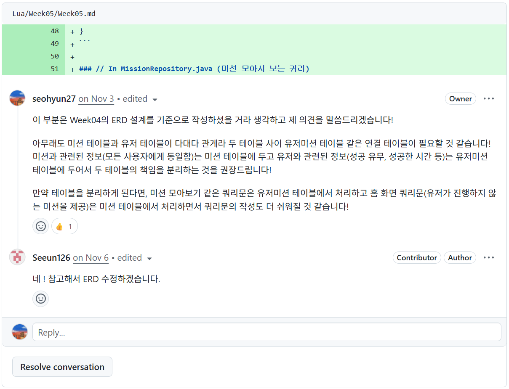
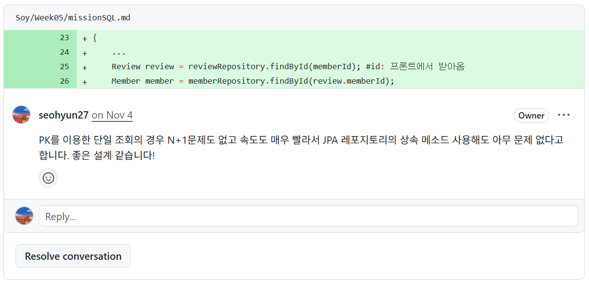
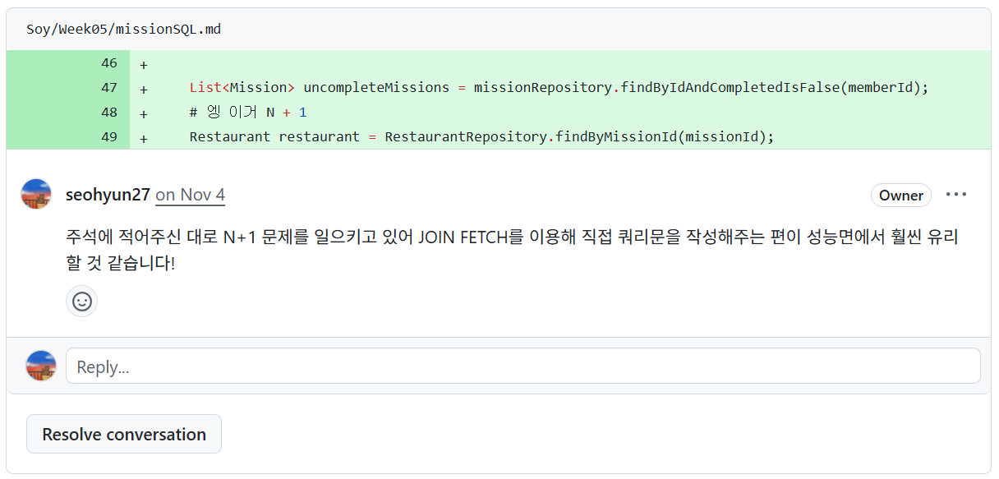
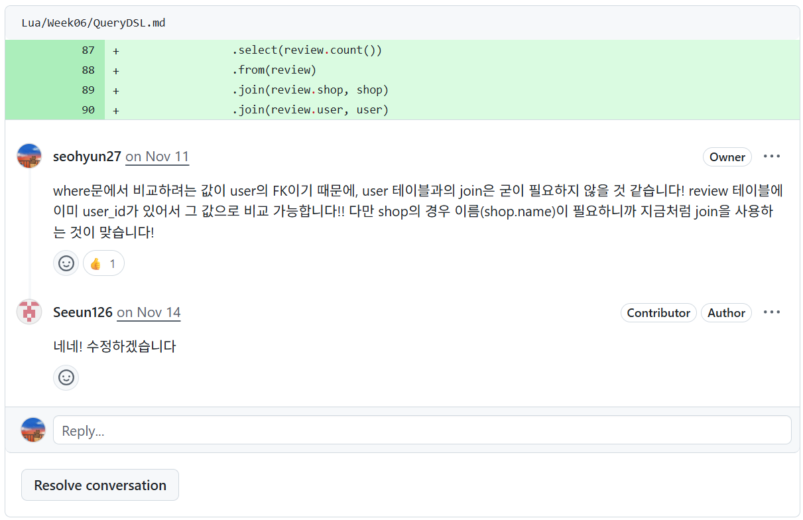

# 🌱 UMC 9th Yeungnam Univ. Spring Boot Study
> **영남대학교 UMC 9기 Spring Boot 파트 미션 및 코드 리뷰 저장소**

## 📢 Overview
* **Role:** Spring Part Leader (파트장)
* **Period:** 2025.09 ~ 2025.12
* **Schedule:** 매주 금요일 16:30 ~ 18:30 (Offline, 영남대학교 도서관)
* **Goal:** Spring Boot의 핵심 개념 학습 및 실전 미션 수행, **상호 코드 리뷰를 통한 동반 성장**

## 📚 Curriculum & Mission
매주 Spring Boot의 핵심 주제를 학습하고 이에 대한 미션을 수행하였습니다.

| Week | Topic | Key Keywords | Study Note |
| :---: | :--- | :--- | :---: |
| **0주차** | 데이터베이스 설계 | `ERD`, `정규화` | [📄 요약 보기](https://github.com/seohyun27/umc-study-note/tree/main/Week00) |
| **1주차** | SQL - Query 작성 | `join`, `subquery`, `트랜잭션`, `where` | [📄 요약 보기](https://github.com/seohyun27/umc-study-note/tree/main/Week01) |
| **2주차** | Spring Boot 개념 | `제어 역전`, `의존성 주입`, `Bean` | [📄 요약 보기](https://github.com/seohyun27/umc-study-note/tree/main/Week02) |
| **3주차** | API 설계 및 개발 | `REST API`, `HTTP 메소드` | [📄 요약 보기](https://github.com/seohyun27/umc-study-note/tree/main/Week03) |
| **4주차** | JPA 기초 및 프로젝트 구조 | `엔티티 매핑`, `N+1 문제`, `계층형`, `도메인형` | [📄 요약 보기](https://github.com/seohyun27/umc-study-note/tree/main/Week04) |
| **5주차** | JPA 활용 | `Spring Data JPA`, `영속성`, `JPQL` | [📄 요약 보기](https://github.com/seohyun27/umc-study-note/tree/main/Week05) |
| **6주차** | QueryDSL | `동적쿼리`, `QueryDSL` | [📄 요약 보기](https://github.com/seohyun27/umc-study-note/tree/main/Week06) |
| **7주차** | API 응답 통일 & 에러 핸들러 | `ApiResponse`, `DTO`, `컨트롤러`, `예외처리` | [📄 요약 보기](https://github.com/seohyun27/umc-study-note/tree/main/Week07) |
| **8주차** | Swagger & Annotation | `Swagger`, `커스텀 어노테이션` | [📄 요약 보기](https://github.com/seohyun27/umc-study-note/tree/main/Week08) |
| **9주차** | Paging | `Page`, `Slice` | [📄 요약 보기](https://github.com/seohyun27/umc-study-note/tree/main/Week09) |
| **10주차** | 로그인/회원가입 | `Spring Security`, `Session`, `JWT` | [📄 요약 보기](https://github.com/seohyun27/umc-study-note/tree/main/Week10) |

## 📝 Study Resources (Workbook Summary)
UMC 중앙 워크북을 기반으로, **매주 스터디 진행을 위해 제가 직접 재구성하고 요약한 학습 자료**입니다.  
팀원들이 개념을 더 쉽게 이해할 수 있도록 예제와 설명을 보충했습니다. 
Curriculum & Mission의 Study Note는 모두 이곳의 요약본입니다.

* **Repository:** [📂 Spring Boot Study Notes & Summary](https://github.com/seohyun27/umc-study-note.git)
* **Description:** 워크북 핵심 요약, 추가 보충 개념 정리, 트러블 슈팅 팁 포함

## 💬 Code Review & Feedback Culture
단순한 과제 제출이 아닌, **Pull Request(PR)** 기반의 코드 리뷰 문화를 정착시켰습니다. 
파트장으로서 팀원들의 코드를 리뷰하며 **더 나은 설계와 클린 코드**에 대해 논의했습니다.

### 🔄 Review Process
1. **Mission Clear:** 매주 미션 기능을 구현하고 본인 브랜치에 Push
2. **Pull Request:** `Develop` 브랜치로 PR 생성
3. **Code Review:** 파트장 및 팀원 간 상호 리뷰 진행 (승인 시 Merge)
4. **Refactoring:** 피드백 반영 및 코드 개선

### 💡 My Feedback Highlights (리뷰 사례)

#### 1. DB 정규화: 다대다(M:N) 관계 해소 및 책임 분리
> 미션(정적 정보)과 유저의 수행 기록(동적 정보)을 한 테이블에서 관리하려는 설계를 지적하고, **중간 매핑 테이블(UserMission)을 도입하여 책임을 분리**하도록 가이드했습니다. 이를 통해 데이터 중복을 막고 쿼리 작성의 효율성을 높였습니다.

#### 2. JPA 조회 성능 분석 및 상황별 쿼리 최적화 전략
> 모든 쿼리를 튜닝하는 것이 아니라, PK 기반 단건 조회의 효율성과 연관관계 목록 조회의 N+1 문제를 명확히 구분했습니다. 성능 이슈가 발생하는 지점에만 선별적으로 Fetch Join을 도입하여 생산성과 성능의 균형을 맞췄습니다.  
**Case 1. 효율적인 조회: 단건 조회는 기본 메소드 유지를 권장**

**Case 2. 성능 이슈 해결: 리스트 조회 시 발생하는 N+1 문제에 Fetch Join 적용**

#### 3. 쿼리 효율화: FK 활용을 통한 불필요한 Join 제거
> 필터링 조건인 `user_id`가 이미 Review 테이블의 FK로 존재함을 파악하여, **불필요한 User 테이블과의 Join을 제거**하도록 제안했습니다. 무의식적인 연관관계 탐색을 줄이고 쿼리 성능을 최적화했습니다.

## 📝 Part Leader's Note
### 🚀 Role & Retrospective

**1. Facilitator: 동반 성장을 위한 기술 가이드** 
팀원 간 기술 격차를 줄이고 전체적인 개발 역량을 상향 평준화하는 데 주력했습니다.

* **Onboarding Guide:** Spring Boot가 낯선 팀원에게 **'Controller - Service - Repository - Entity'**로 이어지는 계층형 아키텍처(Layered Architecture)의 데이터 흐름을 도식화하여 설명하고, 프로젝트 적응을 도왔습니다.
* **Mentoring:** 진도를 어려워하는 팀원을 방치하지 않고 1:1로 이끌어 전원 완주를 목표로 했습니다.

**2. Deep Dive: 집요한 탐구와 지식 공유 (N+1 문제)** 
단순한 개념 암기가 아닌, 원리 이해를 최우선으로 했습니다.

* **Collaborative Learning:** 'N+1 문제'의 발생 원인과 해결법(Fetch Join, Entity Graph 등)이 명확히 이해되지 않자, **2주간의 집중 탐구 기간**을 가졌습니다.
* **Seminar:** 각자 조사한 내용을 바탕으로 세미나 형식의 상호 발표를 진행했고, 이를 통해 **팀원 전원이 해당 이슈를 완벽하게 숙지하고 실무에 적용**할 수 있게 되었습니다.

**3. Insight: 코드 리뷰의 진정한 가치** 
이번 활동을 통해 생애 첫 코드 리뷰를 경험하며 개발자로서 시야를 확장했습니다.

* **Reader의 관점:** '작성하는 코드'에서 '읽히는 코드'로 관점이 전환되었습니다. 타인의 코드를 읽으며 의도를 파악하는 과정 자체가 큰 공부가 되었습니다.
* **Feedback Loop:** 코드 리뷰가 단순한 지적이 아니라, 서로의 생각을 맞추고 **더 나은 설계를 찾아가는 협업의 핵심 과정**임을 깨닫게 되었습니다.

