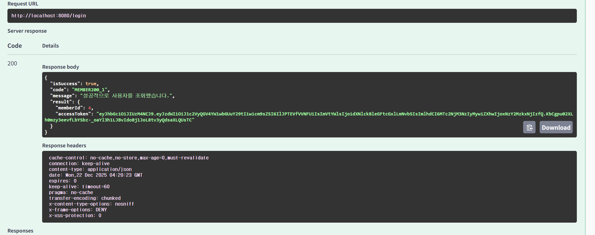
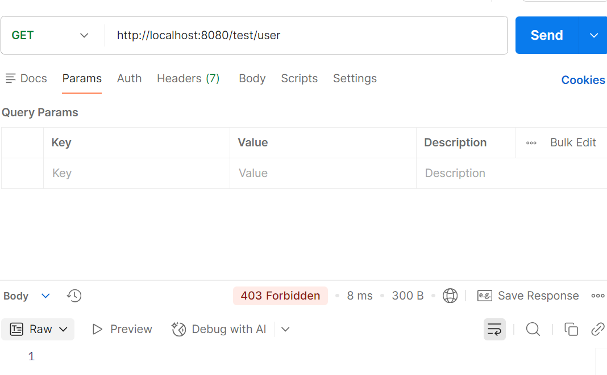
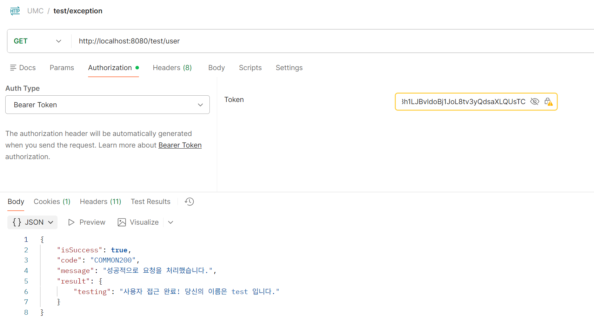

# jwt 로그인 트러블 슈팅
### 1. jwtUtil에서 빠진 코드 들이 많아... 블로그, 깃허브 등을 이용해 참고하였다..
- KEYS,JWTS가 자동으로 클래스 가져오기가 뜨지 않아.. 찾아봤는데
- import io.jsonwebtoken.*;
  import io.jsonwebtoken.security.Keys; 
- 이거는 왠진 모르겠지만 자동으로 임포트 되지 않았다.
### 2. application.yml에서 jwt 인식안됨... 
```groovy
Could not resolve placeholder 'jwt.token.secretKey'
```
- jwt를 spring 안에 집어넣었는데 밖으로 빼야 된다고 했다.
### 3. jwt 모듈이 인식안됨
```groovy
io.jsonwebtoken.lang.UnknownClassException:
Unable to load class named [io.jsonwebtoken.impl.security.KeysBridge]

Have you remembered to include the jjwt-impl.jar in your runtime classpath?
```
```groovy
    implementation 'io.jsonwebtoken:jjwt-api:0.12.3'
    implementation 'io.jsonwebtoken:jjwt-impl:0.12.3'
    implementation 'io.jsonwebtoken:jjwt-jackson:0.12.3'
    implementation 'org.springframework.boot:spring-boot-configuration-processor'
```
이걸 runtime으로 바꾸라고 했다.
```groovy
// Jwt
implementation 'io.jsonwebtoken:jjwt-api:0.12.3'
runtimeOnly  'io.jsonwebtoken:jjwt-impl:0.12.3'
runtimeOnly  'io.jsonwebtoken:jjwt-jackson:0.12.3'
```
## 테스트

### 권한 테스트
#### 헤더에 auth 없을 때

#### 헤더 넣어줬을 때
