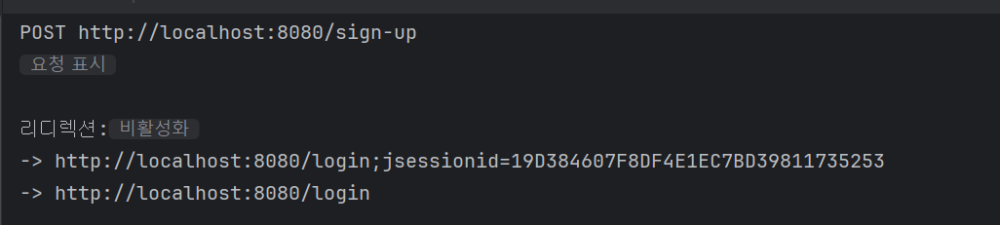
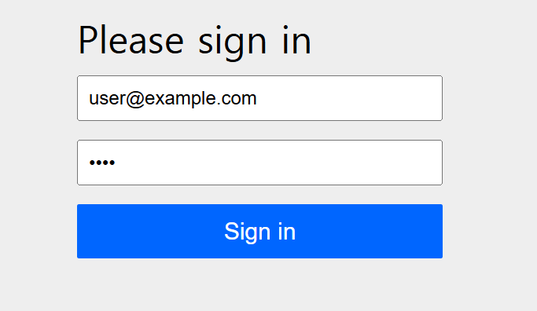
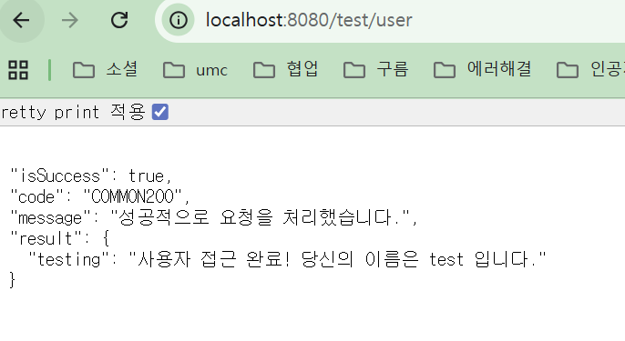
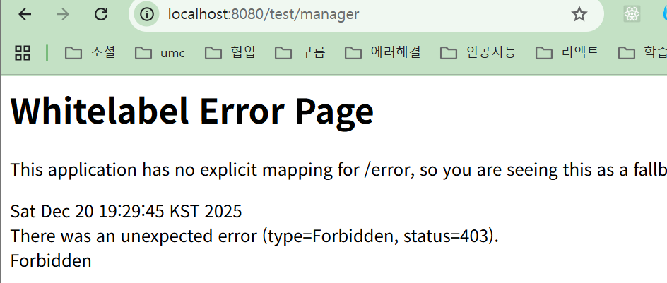

# 셰션 로그인 : 트러블 슈팅

```java
    private final String[] allowUris = {
            // Swagger 허용
            "/sign-up",
            "/swagger-ui/**",
            "/swagger-resources/**",
            "/v3/api-docs/**",
    };

    @Bean
    public SecurityFilterChain securityFilterChain(HttpSecurity http) throws Exception {
        http
                .authorizeHttpRequests(requests -> requests
                        .requestMatchers(allowUris).permitAll()
                        .requestMatchers("/admin/**").hasRole("ADMIN")
                        .anyRequest().authenticated()
                )
    }
```
처음 설정했을 때 permitAll을 줬는데도 자꾸 로그인하라고 떠서 문제
다 똑같이 했는데 뭐가 문젠지 모르겠었음
## 원인 1️⃣ CSRF 기본 활성화 (제일 흔한 원인)
- 👉 GET /sign-up 페이지 접근은 허용됨
- ❌ 하지만 POST /sign-up은 다를 수 있음

Spring Security 기본값:

CSRF = ENABLED

CSRF 토큰 없음

👉 403 Forbidden

👉 formLogin 켜져 있어서

👉 로그인 페이지로 redirect

## 해결 : 회원가입 완료
.csrf(AbstractHttpConfigurer::disable)
```json
[
{
"member_id": 4,
"created_at": "2025-12-20 19:06:01.271972",
"updated_at": "2025-12-20 19:06:01.271972",
"address": "string",
"birth_date": "2025-12-20",
"gender": "FEMALE",
"inactivate_at": null,
"name": "test",
"point": 0,
"member_type": "ROLE_USER",
"email": "user@example.com",
"password": "$2a$10$D5hMIHWxVzlyodcDvdG3FeqrVZ8Md9c37H5gfAW.yuwPx5WRLFG4q"
}
]
```
## 접근 권한 테스트

### 1. 권한 설정
.requestMatchers("/test/user").hasRole("USER")
### 2. test 컨트롤러 작성
```java
    @GetMapping("/user")
    public ApiResponse<TestResDTO.Testing> test(@AuthenticationPrincipal CustomUserDetails customUserDetails)
    {
        Member member = memberRepository.findByEmail(customUserDetails.getUsername()).orElseThrow();
        GeneralSuccessCode code = GeneralSuccessCode.SUCCESS_CODE;
        return ApiResponse.onSuccess(code,TestConverter.toTestingDTO("사용자 접근 완료! 당신의 이름은 " + member.getName() + " 입니다."));
    }
```
### 3. 실제 로그인 후 확인

### 4. test 페이지 접속


성공적으로 권한 부여 완료!!
admin 권한 페이지는 접근 못하는 지 확인

`
